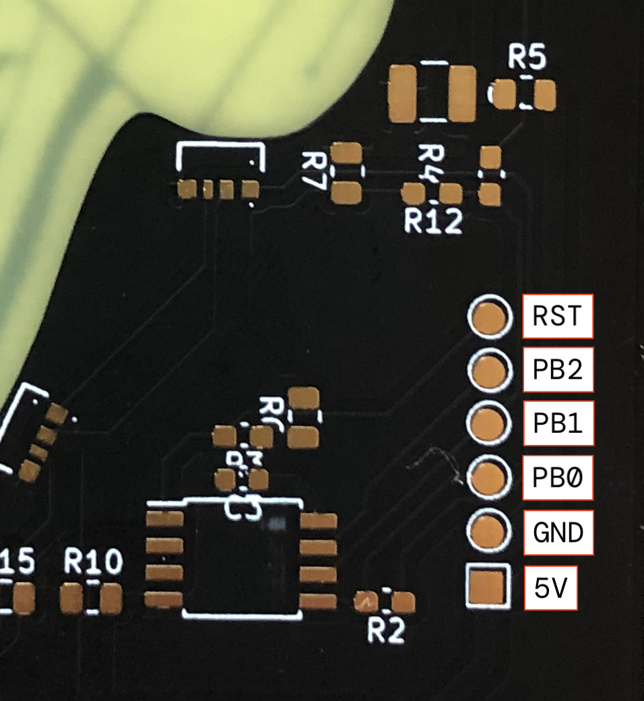
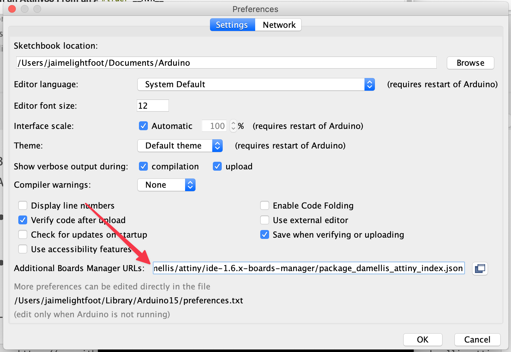
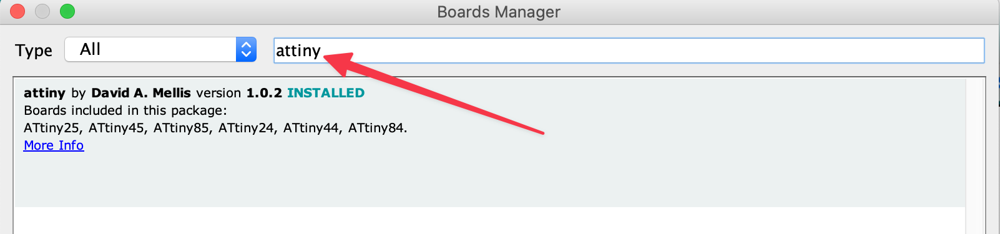
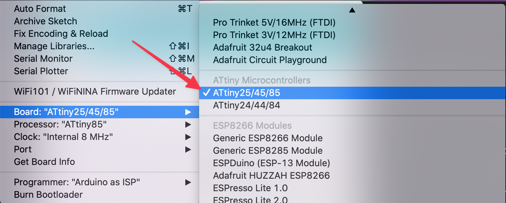

# RSC Jellyfish Reprogramming Guide

This is a repository describing how to reprogram the 2023 [Red Society Club](https://discord.gg/thersc) "jellyfish" badge. 


The jellyfish badge has an ATTiny85 and exposed programming pins. There are other ways of programming it (such as with an [AVR programmer](https://www.sparkfun.com/products/11801)), but this guide uses an Arduino since that's what I had on hand and that's what most other people will likely have access to. 

To read about the board design, check out this [blog post series](https://lightfootlabs.io/blog/rsc-badgelife-journey). 

## Features
* 10 programmable RGB LEDs
* UV light and button input
* Battery and USB power (USB is for power only and cannot be used for programming, sorry!)
* Exposed pads for re-programming the board

## Hardware Setup
You will need an Arduino (I used an Arduino Uno), and a USB cable to connect it to your computer. 

You will also need 6 jumper wires either soldered to the pins, or you will need a 6-pin connector. Ideally you'd use a 2.54 mm pitch pogo pin connector, but you can also use a 6-pin male header with the same pitch. 

I ordered a pogo pin connector for this project but it never showed up, so I used a 6-pin header instead. If you take this approach make sure you hold the header to the board at an angle so you are making sufficient electrical contact as shown in the photo. Not enough solid contact = Arduino IDE will throw errors when you try to program the board. 


Whichever method you use, keep in mind that you will be providing power to the board through the 5V and GND pins, so be careful about aligning them correctly (so you don't slip and short anything out). 

Here is the board pinout: 



Connect the wires as follows: 

| Board Pins | Arduino Pins (Arduino Uno) |
| ---------- | -------------------------- |
| RST        |           10               |
| PB2        |           13               |
| PB1        |           12               |
| PB0        |           11               |
| GND        |           GND              |
| 5V         |           5V               |

You also need a 10-22uF capacitor between RESET and GND on your Arduino to prevent the Arduino from resetting itself. You can use a breadboard like a normal person if you want or just put the cap in the Arduino header like so: 


## Arduino IDE Setup
If you do not already have Arduino IDE installed, [do so with these instructions](https://www.arduino.cc/en/software). 

Next, you will need to add support for the ATTiny85 in Arduino IDE's board manager. This is a two step process.

First, you need to tell Arduino IDE where to look for additional board information. With the Arduino IDE open, go to `File > Preferences`. Look for `Additional Boards Manager URL` and add `https://raw.githubusercontent.com/damellis/attiny/ide-1.6.x-boards-manager/package_damellis_attiny_index.json` to the list (add a comma after the previous URL). Click OK. After that, restart Arduino IDE. 



Next, you need to install the ATTiny85 library. Go to `Tools > Boards: ... > Boards Manager`. Search for `attiny`. You should get a result published by David A Mellis. Install that (my photo shows mine already installed). You'll probably need to restart the IDE again after this step. 



Now when you view `Tools > Board: ...` you should see ATTiny85 in the list. You may need to scroll. 



Credit: https://www.instructables.com/How-to-Program-an-Attiny85-From-an-Arduino-Uno/  Note: if you are programming an ATTiny85 for the first time you will need to follow steps 3 and 6 in here to burn the bootloader. If you already have a badge with rainbow lights, you can skip this. 

## Programming
Currently, the jellyfish boards are using Adafruit's Neopixel library. If you want to write your own code, that's fine! But the Neopixel library 

### Neopixels
If you want to use the Neopixel library, [follow these steps to install it](https://learn.adafruit.com/adafruit-neopixel-uberguide/arduino-library-installation). 

### IMPORTANT NOTES
**I strongly recommend that you do not change the LED brightness unless you are using USB power.** Read this section to learn about why you don't want too-bright LEDs on battery power. 

#### Current brightness levels
Currently, the LEDs are PWMed to about 1/3 of their full brightness, or a value of 80 out of 255. This is because at DEFCON, most people will be running their badges off of AAA batteries and we're trying to conserve power. And the badges will likely be in the dark, which means we don't need to try so hard to make them look bright. 

If you want to turn up the brightness, that is fine. But I strongly recommend you only do it if you powering the badge via USB. 

#### LED power consumption
Each Neopixel has 3 LEDs in it (R, G, B). At full brightness, each LED can draw about 20mA. 3 LED colors x 20mA = 60mA * 10 Neopixels = 600mA at 5V. That's a lot for a battery, or even USB! This also doesn't account for other current consumption on the badge, or the boost converter, as we'll see in the next section. 

With a brightness setting of "80" (out of 255), the overall current consumption (powered by 1.5V, as provided by a AAA battery) is ~250mA. You will see this line in the code provided below. 

#### Battery power vs USB power AKA why does this matter? 
If you turn up the brightness, you are using more current and that drains the battery faster. However, it's not just a matter of you running out of battery capacity faster. 

There is a component on the badge called a boost converter, which steps up the voltage from battery voltage (which starts at ~1.5V for a AAA battery) to 5V, which is what the ATTiny85 and LEDs need. It achieves this "step up" by using higher current at a lower voltage on the input side, and converting it to lower current at a higher voltage on the output side. 

The bigger the difference in voltage, the more current it needs to keep both sides of the 'equation' equal. 

As the battery drains, the voltage drops and this difference between the battery voltage and the output voltage becomes larger and the components have to 'work' harder to make up for it. More current flowing through components also mean they get hot. Battery discharge capacity is not a linear function. You can see how this can become an undesirable feedback loop, especially when the brightness is turned all the way up. 

Compare that to USB where the input voltage (should) be consistent. Components might still get hot due to lots of current flowing through them, but with a constant input voltage, you won't have to worry about a growing voltage differential. Note though that some devices will not provide more than 500mA of current over USB. 

**TL;DR: A brightness of "80" was chosen because it seemed to be a good trade-off between battery consumption and visual brightness. Powering via batteries is not a simple linear relationship and you should probably keep the brightness below 90 (out of 255). Powering over USB gives you more flexibility.**

If you are unsure about what to use or this explanation didn't make sense, hit me up on Discord in RSC (#jaime3312). 

### Current software
Here is the current software. You can look at the Neopixel example code (File > Examples > Adafruit Neopixel, after installing the Neopixel library as listed above) for more ideas, or write your own from scratch. 

```
#include <Adafruit_NeoPixel.h>
#ifdef __AVR__
  #include <avr/power.h>
#endif

#define LEDS 0      // physically pin 5
#define BUTTON 1    // UV light button 

Adafruit_NeoPixel strip = Adafruit_NeoPixel(10, LEDS, NEO_GRB + NEO_KHZ800);

void setup() {
  #if defined (__AVR_ATtiny85__)
    if (F_CPU == 16000000) clock_prescale_set(clock_div_1);
  #endif

  pinMode(BUTTON, INPUT);

  strip.begin();
  strip.setBrightness(80);   // highest value is 255: DO NOT CHANGE WITHOUT READING POWER CONSUMPTION NOTES
  strip.show();
}

void turnOffLEDs() {
  // Note: strip.show() implements the change
  strip.clear(); 
  strip.show();
}

int buttonState = 0;

void loop() {
  rainbowCycle(20);
}

void rainbowCycle(uint8_t wait) {
  uint16_t i, j;

  for(j=0; j<256*5; j++) { 
    buttonState = digitalRead(BUTTON);

    // Is UV light button pressed? 
    if (buttonState == LOW) {
      // if not, run rainbow colors (or your own code here) continuously

      for(i=0; i< strip.numPixels(); i++) {
        strip.setPixelColor(i, Wheel(((i * 256 / strip.numPixels()) + j) & 255));
      }
      strip.show();
      delay(wait);
    }
    else {
      turnOffLEDs(); // if so, turn off all LEDs so we can actually see the UV light
      delay(200); // slight delay before turning LEDs back on
    }
  }
}

// Neopixel-provided function
// Input a value 0 to 255 to get a color value.
// The colours are a transition r - g - b - back to r.
uint32_t Wheel(byte WheelPos) {
  WheelPos = 255 - WheelPos;
  if(WheelPos < 85) {
    return strip.Color(255 - WheelPos * 3, 0, WheelPos * 3);
  }
  if(WheelPos < 170) {
    WheelPos -= 85;
    return strip.Color(0, WheelPos * 3, 255 - WheelPos * 3);
  }
  WheelPos -= 170;
  return strip.Color(WheelPos * 3, 255 - WheelPos * 3, 0);
}
```

Make your changes, and hit the arrow button to program the board (while holding the 6 pin connector or pogo pin connector to the board carefully, as described in the hardware section). Happy programming!
